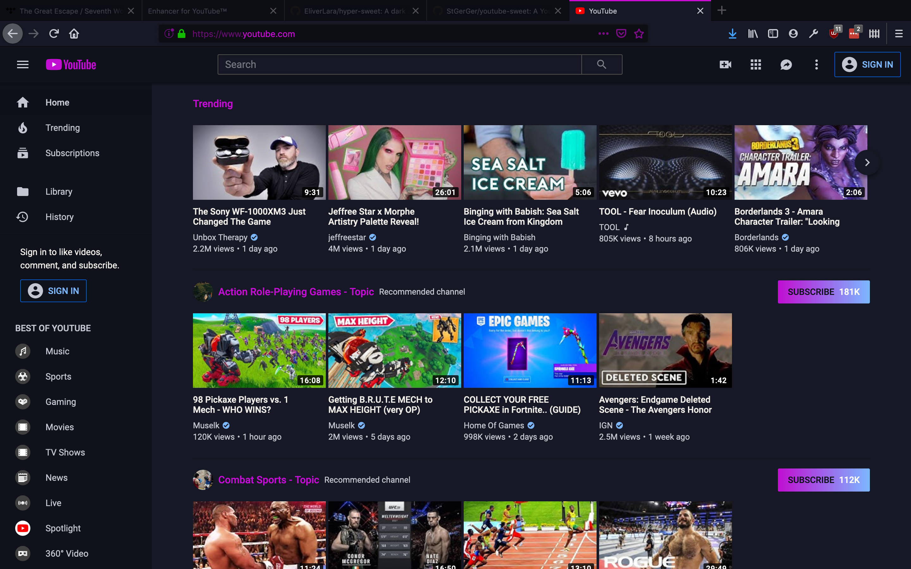

# youtube-sweet
A YouTube theme that matches [hyper-sweet](https://github.com/EliverLara/hyper-sweet) and [Sweet-Dark](https://addons.mozilla.org/en-US/firefox/addon/sweet-dark) by EliverLara.

## Screenshots

## How to use

1. Install the Firefox extension [Enhancer for YouTube](https://addons.mozilla.org/en-US/firefox/addon/enhancer-for-youtube/).
2. Open the settings for Enhancer for YouTube and scroll to **Theme**.
3. Select **Custom theme** and paste the contents of [sweet.css](sweet.css) into the text box.
4. If you come across any problems, feel free to open an issue!
